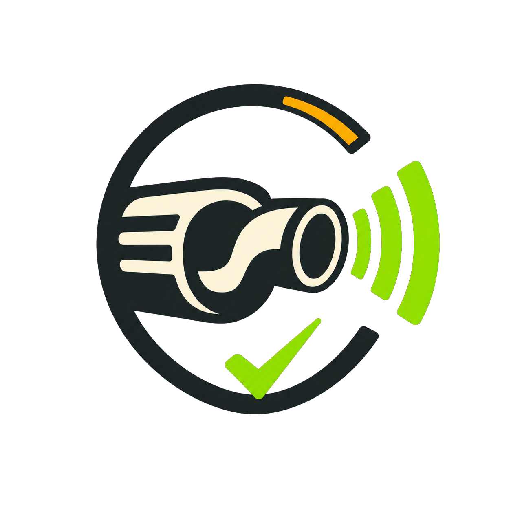

# EscapaLegal



Aplicativo web mobile-first para fazer uma **verificação orientativa do ruído do escapamento** usando o microfone do celular.

## Acessar o app

**[Abrir o EscapaLegal](https://willianjesusdasilva.github.io/escapalegal/)**

O site é publicado automaticamente pelo GitHub Pages a cada atualização da branch `main`.

## Funcionalidades

- medição sonora pelo microfone do celular;
- indicação visual verde, laranja ou vermelha;
- registro da maior leitura durante o teste;
- referências para carro de passeio, motor traseiro e motocicleta;
- limite personalizado conforme o manual do veículo;
- ajuste de calibração do microfone;
- procedimento orientativo de posicionamento e rotação do motor;
- interface responsiva e otimizada para celular.

## Importante

O EscapaLegal é uma ferramenta educativa de triagem. Microfones de celulares não são decibelímetros certificados e podem aplicar ganho automático ao áudio.

Uma avaliação oficial deve seguir a ABNT NBR 9714 e utilizar equipamento calibrado pelo INMETRO ou por laboratório da Rede Brasileira de Calibração. Quando houver um nível de ruído parado declarado pelo fabricante, a referência de fiscalização é esse valor acrescido de 3 dB(A).

Referências:

- [Resolução CONAMA nº 418/2009](https://www.ibama.gov.br/sophia/cnia/legislacao/CONAMA/RE0418-251109.PDF)
- [Normas federais de fiscalização de emissões](https://www.gov.br/participamaisbrasil/consolidacao-das-normas-sobre-a-fiscalizacao-pelas-autoridades-de-transito)

## Desenvolvimento local

Requisitos: Node.js 22 ou superior e pnpm.

```bash
pnpm install
pnpm dev
```

Abra `http://localhost:3000` no navegador.

## Compilação

```bash
# Verificar a aplicação principal
pnpm build

# Gerar os arquivos estáticos do GitHub Pages
pnpm build:pages
```

Os arquivos estáticos são gerados em `pages-dist/`.

## Privacidade

O áudio é analisado localmente pelo navegador. O aplicativo não grava nem envia o som captado pelo microfone para um servidor.

## Licença

Projeto desenvolvido para fins educativos. Consulte a legislação e as regras locais aplicáveis antes de realizar modificações no sistema de escapamento.
